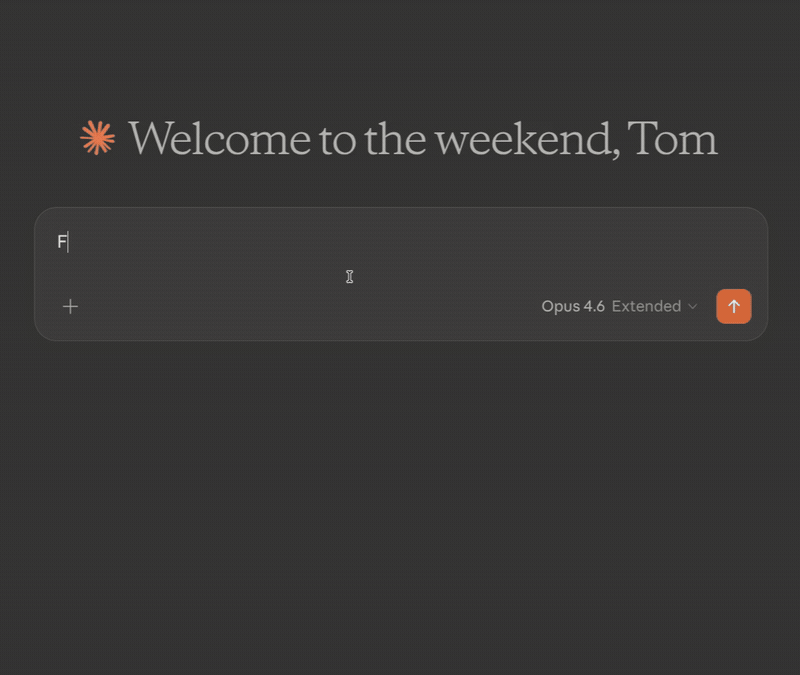

# Thunderbird MCP

[](#what-you-can-do)
[](#security)
[](https://www.thunderbird.net/)
[](LICENSE)

Give your AI assistant full access to Thunderbird — search mail, compose messages, manage filters, and organize your inbox. All through the [Model Context Protocol](https://modelcontextprotocol.io/).

<p align="center">
  
</p>

> Inspired by [bb1/thunderbird-mcp](https://github.com/bb1/thunderbird-mcp). Rewritten from scratch with a bundled HTTP server, proper MIME decoding, and UTF-8 handling throughout.

---

## Why?

Thunderbird has no official API for AI tools. Your AI assistant can't read your email, can't help you draft replies, can't organize your inbox. This extension fixes that — it exposes 20 tools over MCP so any compatible AI (Claude, GPT, local models) can work with your mail the way you'd expect.

Compose tools open a review window before sending. **Nothing gets sent without your approval.**

---

## How it works

```
                    stdio              HTTP (localhost:8765)
  MCP Client  <----------->  Bridge  <--------------------->  Thunderbird
  (Claude, etc.)           mcp-bridge.cjs                    Extension + HTTP Server
```

The Thunderbird extension embeds a local HTTP server. The Node.js bridge translates between MCP's stdio protocol and HTTP. Your AI talks stdio, Thunderbird talks HTTP, the bridge connects them.

---

## What you can do

### Mail

| Tool | Description |
|------|-------------|
| `listAccounts` | List all email accounts and their identities |
| `listFolders` | Browse folder tree with message counts — filter by account or subtree |
| `searchMessages` | Find emails by subject, sender, recipient, date range, or within a specific folder |
| `getMessage` | Read full email content with optional attachment saving to disk |
| `getRecentMessages` | Get recent messages with date and unread filtering |
| `updateMessage` | Mark read/unread, flag/unflag, move between folders, or trash |
| `deleteMessages` | Delete messages — drafts are safely moved to Trash |
| `createFolder` | Create new subfolders to organize your mail |

### Compose

| Tool | Description |
|------|-------------|
| `sendMail` | Open a compose window with pre-filled recipients, subject, and body |
| `replyToMessage` | Reply with quoted original and proper threading |
| `forwardMessage` | Forward with all original attachments preserved |

All compose tools open a window for you to review and edit before sending.

### Filters

| Tool | Description |
|------|-------------|
| `listFilters` | List all filter rules with human-readable conditions and actions |
| `createFilter` | Create filters with structured conditions (from, subject, date...) and actions (move, tag, flag...) |
| `updateFilter` | Modify a filter's name, enabled state, conditions, or actions |
| `deleteFilter` | Remove a filter by index |
| `reorderFilters` | Change filter execution priority |
| `applyFilters` | Run filters on a folder on demand — let your AI organize your inbox |

Full control over Thunderbird's message filters. Changes persist immediately. Your AI can create sorting rules, adjust priorities, and run them on existing mail.

### Contacts & Calendar

| Tool | Description |
|------|-------------|
| `searchContacts` | Look up contacts from your address books |
| `listCalendars` | List all calendars (local and CalDAV) |
| `createEvent` | Open a pre-filled calendar event dialog for review |

---

## Setup

### 1. Install the extension

```bash
git clone https://github.com/TKasperczyk/thunderbird-mcp.git
```

Install `dist/thunderbird-mcp.xpi` in Thunderbird (Tools > Add-ons > Install from File), then restart. A pre-built XPI is included in the repo — no build step needed.

### 2. Configure your MCP client

Add to your MCP client config (e.g. `~/.claude.json` for Claude Code):

```json
{
  "mcpServers": {
    "thunderbird-mail": {
      "command": "node",
      "args": ["/absolute/path/to/thunderbird-mcp/mcp-bridge.cjs"]
    }
  }
}
```

That's it. Your AI can now access Thunderbird.

---

## Security

The extension listens on `localhost:8765` only. No remote access. However, any local process can reach it while Thunderbird is running — keep this in mind on shared machines.

---

## Troubleshooting

| Problem | Fix |
|---------|-----|
| Extension not loading | Check Tools > Add-ons and Themes. Errors: Tools > Developer Tools > Error Console |
| Connection refused | Make sure Thunderbird is running and the extension is enabled |
| Missing recent emails | IMAP folders can be stale. Click the folder in Thunderbird to sync, or right-click > Properties > Repair Folder |
| Tool not found after update | Reconnect MCP (`/mcp` in Claude Code) to pick up new tools |

---

## Development

```bash
# Build the extension
./scripts/build.sh

# Test the HTTP API directly
curl -X POST http://localhost:8765 \
  -H "Content-Type: application/json" \
  -d '{"jsonrpc":"2.0","id":1,"method":"tools/list"}'

# Test the bridge
echo '{"jsonrpc":"2.0","id":1,"method":"tools/list"}' | node mcp-bridge.cjs
```

After changing extension code: remove from Thunderbird, restart, reinstall the XPI, restart again. Thunderbird caches aggressively.

---

## Project structure

```
thunderbird-mcp/
├── mcp-bridge.cjs              # stdio <-> HTTP bridge
├── extension/
│   ├── manifest.json
│   ├── background.js           # Extension entry point
│   ├── httpd.sys.mjs           # Embedded HTTP server (Mozilla)
│   └── mcp_server/
│       ├── api.js              # All 20 MCP tools
│       └── schema.json
└── scripts/
    ├── build.sh
    └── install.sh
```

## Known issues

- IMAP folder databases can be stale until you click on them in Thunderbird
- Email bodies with control characters are sanitized to avoid breaking JSON
- HTML-only emails are converted to plain text (original formatting is lost)

---

## License

MIT. The bundled `httpd.sys.mjs` is from Mozilla and licensed under MPL-2.0.
