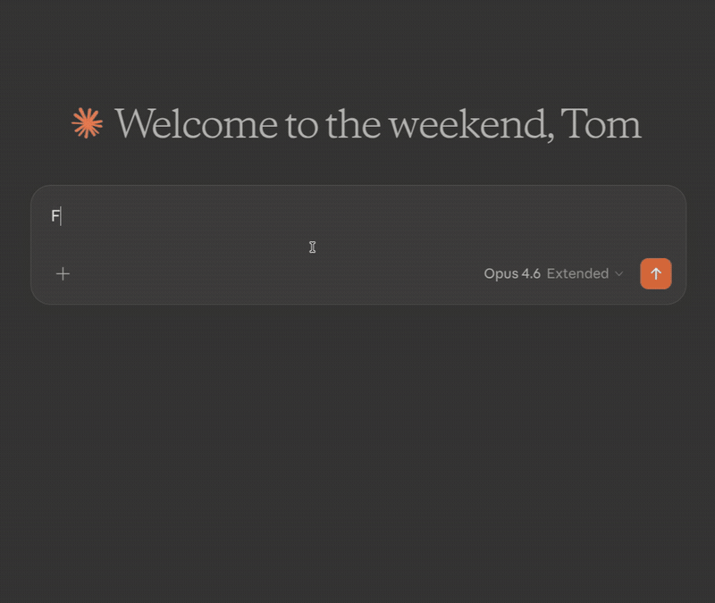
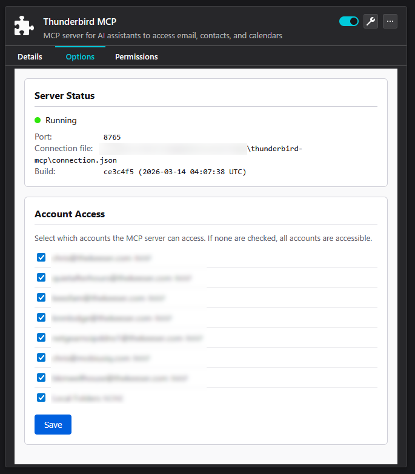

# Thunderbird MCP

[](#what-you-can-do)
[](#security)
[](https://www.thunderbird.net/)
[](#testing)
[](LICENSE)

Give your AI assistant full access to Thunderbird -- search mail, compose messages, manage filters, tag and organize your inbox, and manage contacts. All through the [Model Context Protocol](https://modelcontextprotocol.io/).

<p align="center">
  
</p>

> Inspired by [bb1/thunderbird-mcp](https://github.com/bb1/thunderbird-mcp). Rewritten from scratch with a bundled HTTP server, proper MIME decoding, and UTF-8 handling throughout.

---

## Why?

Thunderbird has no official API for AI tools. Your AI assistant can't read your email, can't help you draft replies, can't organize your inbox. This extension fixes that -- it exposes 32 tools over MCP so any compatible AI (Claude, GPT, local models) can work with your mail the way you'd expect.

Compose tools open a review window before sending. **Nothing gets sent without your approval.**

---

## How it works

```
                    stdio              HTTP (localhost)
  MCP Client  <----------->  Bridge  <--------------------->  Thunderbird
  (Claude, etc.)           mcp-bridge.cjs                    Extension + HTTP Server
```

The Thunderbird extension embeds a local HTTP server. The Node.js bridge translates between MCP's stdio protocol and HTTP. Your AI talks stdio, Thunderbird talks HTTP, the bridge connects them. The bridge handles MCP lifecycle methods (initialize, ping) locally, so clients can connect even before Thunderbird is fully loaded.

---

## What you can do

### Mail

| Tool | Description |
|------|-------------|
| `listAccounts` | List all email accounts and their identities |
| `listFolders` | Browse folder tree with message counts -- filter by account or subtree |
| `searchMessages` | Find emails by subject, sender, recipient, date range, read status, tags, or within a specific folder |
| `getMessage` | Read full email content with optional attachment saving -- includes inline CID images |
| `getRecentMessages` | Get recent messages with date and unread filtering |
| `updateMessage` | Mark read/unread, flag/unflag, add/remove tags, move between folders, or trash -- supports bulk via `messageIds` |
| `deleteMessages` | Delete messages -- drafts are safely moved to Trash |
| `createFolder` | Create new subfolders to organize your mail |
| `renameFolder` | Rename an existing mail folder |
| `deleteFolder` | Delete a folder and its contents (moves to Trash, or permanently deletes if already in Trash) |
| `moveFolder` | Move a folder to a new parent within the same account |

### Compose

| Tool | Description |
|------|-------------|
| `sendMail` | Open a compose window with pre-filled recipients, subject, and body. Supports file path and inline base64 attachments |
| `replyToMessage` | Reply with quoted original and proper threading |
| `forwardMessage` | Forward with all original attachments preserved |

All compose tools open a window for you to review and edit before sending. Attachments can be file paths or inline base64 objects (`{name, contentType, base64}`).

### Filters

| Tool | Description |
|------|-------------|
| `listFilters` | List all filter rules with human-readable conditions and actions |
| `createFilter` | Create filters with structured conditions (from, subject, date...) and actions (move, tag, flag...) |
| `updateFilter` | Modify a filter's name, enabled state, conditions, or actions |
| `deleteFilter` | Remove a filter by index |
| `reorderFilters` | Change filter execution priority |
| `applyFilters` | Run filters on a folder on demand -- let your AI organize your inbox |

Full control over Thunderbird's message filters. Changes persist immediately. Your AI can create sorting rules, adjust priorities, and run them on existing mail.

### Contacts

| Tool | Description |
|------|-------------|
| `searchContacts` | Look up contacts from your address books |
| `createContact` | Create a new contact in an address book |
| `updateContact` | Update a contact's name, email, or other properties |
| `deleteContact` | Delete a contact from an address book |

### Calendar

| Tool | Description |
|------|-------------|
| `listCalendars` | List all calendars with read-only, event, and task support flags |
| `createEvent` | Create a calendar event -- opens a review dialog, or set `skipReview` to add directly |
| `listEvents` | Query events by date range with recurring event expansion |
| `updateEvent` | Modify an event's title, dates, location, or description |
| `deleteEvent` | Delete a calendar event by ID |
| `createTask` | Open a pre-filled task dialog for review |

### Access Control

| Tool | Description |
|------|-------------|
| `getAccountAccess` | View which accounts the MCP server can access |
| `setAccountAccess` | Restrict MCP access to specific accounts only |

---

## Settings

The extension includes a settings page (Tools > Add-ons > Thunderbird MCP > Options) where you can:

- View server status, port, connection file path, and build version
- Control which email accounts are visible to MCP clients

<p align="center">
  
</p>

---

## Setup

### 1. Install the extension

```bash
git clone https://github.com/TKasperczyk/thunderbird-mcp.git
```

Install `dist/thunderbird-mcp.xpi` in Thunderbird (Tools > Add-ons > Install from File), then restart. A pre-built XPI is included in the repo -- no build step needed.

### 2. Configure your MCP client

Add to your MCP client config (e.g. `~/.claude.json` for Claude Code):

```json
{
  "mcpServers": {
    "thunderbird-mail": {
      "command": "node",
      "args": ["/absolute/path/to/thunderbird-mcp/mcp-bridge.cjs"]
    }
  }
}
```

That's it. Your AI can now access Thunderbird.

---

## Security

- **Localhost only** -- the HTTP server binds to `127.0.0.1`, never exposed to the network
- **Auth tokens** -- each session generates a cryptographic bearer token, written to a connection file readable only by the current user. The bridge reads this token automatically; unauthorized local processes cannot access the server without it
- **Dynamic port** -- the server tries ports 8765-8774, avoiding conflicts. The bridge discovers the actual port from the connection file
- **Account access control** -- restrict which email accounts are visible to MCP clients via the settings page. Changes take effect immediately, no restart required

The connection file is stored at `<TmpD>/thunderbird-mcp/connection.json` and is cleaned up on shutdown.

---

## Troubleshooting

| Problem | Fix |
|---------|-----|
| Extension not loading | Check Tools > Add-ons and Themes. Errors: Tools > Developer Tools > Error Console |
| Connection refused | Make sure Thunderbird is running and the extension is enabled |
| Missing recent emails | IMAP folders can be stale. Click the folder in Thunderbird to sync, or right-click > Properties > Repair Folder |
| Tool not found after update | Reconnect MCP (`/mcp` in Claude Code) to pick up new tools |
| Port conflict | The server automatically tries ports 8765-8774. Check the connection file for the actual port |

---

## Development

### Build

```bash
npm run build        # Build dist/thunderbird-mcp.xpi
```

The build script embeds a git commit hash and timestamp into the XPI for version tracking (visible in the settings page).

### Test

```bash
npm test             # Run all 160 tests
```

Tests run against the bridge and validation layers without requiring Thunderbird. Tests that need a specific port will skip gracefully when Thunderbird is running. See [TESTING.md](TESTING.md) for details.

### Manual API testing

```bash
# Direct HTTP (requires auth token from connection file)
TOKEN=$(node -p "JSON.parse(require('fs').readFileSync(process.env.TEMP+'/thunderbird-mcp/connection.json','utf8')).token")
curl -X POST http://localhost:8765 \
  -H "Content-Type: application/json" \
  -H "Authorization: Bearer $TOKEN" \
  -d '{"jsonrpc":"2.0","id":1,"method":"tools/list"}'

# Via the bridge (handles auth automatically)
echo '{"jsonrpc":"2.0","id":1,"method":"tools/list"}' | node mcp-bridge.cjs
```

After changing extension code: remove from Thunderbird, restart, reinstall the XPI, restart again. Thunderbird caches aggressively.

---

## Project structure

```
thunderbird-mcp/
├── mcp-bridge.cjs              # stdio <-> HTTP bridge (auth, retry, health checks)
├── extension/
│   ├── manifest.json
│   ├── background.js           # Extension entry point
│   ├── options.html            # Settings page
│   ├── options.js              # Settings page logic
│   ├── httpd.sys.mjs           # Embedded HTTP server (Mozilla)
│   └── mcp_server/
│       ├── api.js              # All 32 MCP tools + experiment API
│       └── schema.json         # WebExtension experiment schema
├── scripts/
│   └── build.cjs               # Cross-platform XPI build script
├── test/
│   ├── auth.test.cjs           # Auth token and connection discovery tests
│   ├── bridge.test.cjs         # MCP lifecycle, forwarding, and sanitization tests
│   ├── validation.test.cjs     # Parameter validation for all 32 tools
│   └── stress.test.cjs         # Edge cases, concurrency, large payloads, adversarial inputs
├── CLAUDE.md                   # Development guide and contribution checklist
├── TESTING.md                  # Test suite documentation
└── dist/
    └── thunderbird-mcp.xpi     # Pre-built extension (install directly)
```

## Known issues

- IMAP folder databases can be stale until you click on them in Thunderbird
- Email bodies with control characters are sanitized to avoid breaking JSON
- HTML-only emails are converted to plain text (original formatting is lost)
- Recurring calendar event CRUD operates on the series, not individual occurrences

---

## License

MIT. The bundled `httpd.sys.mjs` is from Mozilla and licensed under MPL-2.0.
