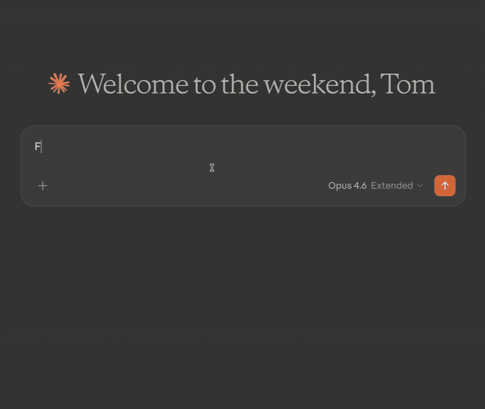

# Thunderbird MCP

[](https://github.com/TKasperczyk/thunderbird-mcp/actions/workflows/ci.yml)
[](#what-you-can-do)
[](#security)
[](https://www.thunderbird.net/)
[](LICENSE)

Give your AI assistant full access to Thunderbird -- search mail, compose messages, manage filters, and organize your inbox. All through the [Model Context Protocol](https://modelcontextprotocol.io/).

<p align="center">
  
</p>

> Inspired by [bb1/thunderbird-mcp](https://github.com/bb1/thunderbird-mcp). Rewritten from scratch with a bundled HTTP server, proper MIME decoding, and UTF-8 handling throughout.

---

## Why?

Thunderbird has no official API for AI tools. Your AI assistant can't read your email, can't help you draft replies, can't organize your inbox. This extension fixes that -- it exposes 42 tools over MCP so any compatible AI (Claude, GPT, local models) can work with your mail the way you'd expect.

Mail sends and event/task creation require review by default because **Block `skipReview`** starts enabled. `skipReview: true` is honored only after you explicitly disable that safety setting. **By default, nothing is sent or created without your review.**

---

## How it works

```
                    stdio              HTTP (localhost:8765-8774)
  MCP Client  <----------->  Bridge  <--------------------->  Thunderbird
  (Claude, etc.)           mcp-bridge.cjs                    Extension + HTTP Server
```

The Thunderbird extension embeds a local HTTP server with session-scoped auth tokens. The Node.js bridge translates between MCP's stdio protocol and HTTP, discovering the port and token automatically via a connection file. The bridge handles MCP lifecycle methods (initialize, ping) locally, so clients can connect even before Thunderbird is fully loaded.

---

## What you can do

### Mail

| Tool | Description |
|------|-------------|
| `listAccounts` | List all email accounts and their identities |
| `listFolders` | Browse folder tree with message counts -- filter by account or subtree |
| `searchMessages` | Search by subject, sender, recipient, body preview, date range, or tags. Multi-word queries are AND-of-tokens (every word must appear somewhere). Prefix with `from:`, `subject:`, `to:`, or `cc:` to restrict to one field. Set `searchBody: true` for full-text body search via Thunderbird's Gloda index. Supports `includeSubfolders`, `countOnly`, and offset-based pagination. Results include `threadId`, folder-local `messageKey`, and a `preview` snippet. By default, `dedupByMessageId` collapses the same RFC Message-ID found in multiple folders/labels into one row and reports the other folder paths in `dupLocations`; set `dedupByMessageId: false` to return every location. |
| `getMessage` | Read full email content -- `bodyFormat`: `markdown` (default), `text`, or `html`. Set `rawSource: true` for the complete RFC 2822 source (all headers + MIME parts). Optional attachment saving. Set `includeInlineImages: true` to append supported inline CID images as MCP image blocks (PNG, JPEG, GIF, or WebP; max 1 MiB base64 per image and 4 MiB total). Skipped images are reported in attachment metadata. |
| `getMessages` | Read full email content for up to the configured batch limit in one call (default 10, max 20). Uses the same `bodyFormat`, `rawSource`, and attachment options as `getMessage`; each item supplies `messageId` and `folderPath`. |
| `getDailyMailDigest` | Read every message received on a local calendar day across accessible incoming folders (including routed notification/newsletter folders), excluding sent/drafts/trash/junk. Reads bounded full-text bodies, deduplicates messages, and separates action, invoice, payment status, banking, subscription, order, appointment, GitHub, security, newsletter, and possible-spam signals. Stable suggested-action types let an app offer expense, recurring-subscription, calendar, and order-tracking workflows without creating anything automatically. |
| `translateMessageToTurkish` | Read one message with translation instructions for the connected AI client. Produces a faithful Turkish translation while preserving Markdown/text structure, links, dates, amounts, names, and identifiers. |
| `getRecentMessages` | Get recent messages with date, unread, and tag filtering. Supports pagination. Results include `threadId` and `preview`. |
| `displayMessage` | Open a message in Thunderbird's GUI -- `3pane` (default), `tab`, or `window` mode |
| `updateMessage` | Mark read/unread, flag/unflag, add/remove tags, move between folders, or trash. Supports bulk RFC IDs and unambiguous folder-local `messageKey`/`messageKeys` for duplicate copies. |
| `deleteMessages` | Delete messages -- drafts are safely moved to Trash |
| `createFolder` | Create new subfolders to organize your mail |
| `renameFolder` | Rename an existing mail folder |
| `deleteFolder` | Delete a folder (moves to Trash, or permanently deletes if already in Trash) |
| `moveFolder` | Move a folder to a new parent within the same account |
| `emptyTrash` | Permanently delete all messages in Trash (including subfolders) |
| `emptyJunk` | Permanently delete all messages in Junk/Spam (including subfolders) |

### Daily briefing and Turkish translation

The digest remains provider-independent: it reads and structures local Thunderbird data, while the connected MCP-capable AI performs the natural-language synthesis. Inline translation can stay entirely local or optionally use the explicitly configured OpenAI high-quality mode described below.

Example requests:

- “Bugünün maillerini bana özetle.”
- “Dünkü e-postalarda ödenmemiş fatura veya güvenlik uyarısı var mı?”
- “Bu e-postayı biçimini bozmadan Türkçeye çevir.”

`getDailyMailDigest` defaults to the current local day, includes read and unread mail, and reads up to 200 messages. It searches all accessible incoming folders so server-side routing to folders such as `Notification` or `Newsletter` does not hide important mail. Classification uses the complete extracted body even when the returned display body is shortened. Each message has one `primaryCategory` for a simple UI plus optional overlapping signals, a distinct `paymentStatus` (`paid`, `due`, `overdue`, `failed`, or `unknown`), and stable `suggestedActions`. Suggested actions always carry `requiresConfirmation: true`; the add-on never records an expense, creates a calendar entry, marks spam, or unsubscribes by itself. Returned classification is heuristic; the AI client should explain uncertainty rather than treating spam or urgency signals as infallible.

#### Translate inside Thunderbird

Open a foreign-language email and click **Türkçeye Çevir** in the message toolbar. The add-on detects the source language locally, then translates the subject and rendered message body directly in the existing reading pane while preserving its HTML layout, links, colors, tables, and paragraphs. A message already detected as Turkish is left untouched. Click the same button again to restore both the original subject and body. Duplicate clicks and results from a message that is no longer open are ignored safely. It uses Thunderbird's built-in Mozilla language detector and translation engine. The add-on enables that local engine during startup; after installing or updating the add-on, fully quit and reopen Thunderbird once.

Thunderbird's translation model catalogue can be absent even though the local engine is bundled. In that case the add-on reads only the two official Mozilla Firefox Remote Settings catalogues and downloads the required compressed model/Wasm files from Mozilla over HTTPS. Every attachment is checked against Mozilla's advertised byte size and SHA-256 hash before use. The initial English-to-Turkish translation is roughly a 16 MB download and models are cached in memory for the current Thunderbird session. The email subject and body are never included in those requests and are not sent to Google, OpenAI, or another translation service.

#### Optional high-quality OpenAI translation

The settings page can enable OpenAI translation with two compact choices: low-latency **Fast AI** uses `gpt-4.1-nano` with OpenAI Fast processing, while **Quality AI** keeps `gpt-4o-mini` on standard processing. The local Mozilla option remains available. If the API key is absent, the request fails, the message exceeds the bounded text limit, validation fails, or the monthly application limit has been reached, the explicit AI buttons show the error without silently sending the message elsewhere. Long messages are divided into bounded batches and up to three batches are translated concurrently while preserving the original layout and applying only a fully validated result.

The OpenAI API key is stored in Thunderbird's password manager and is never returned by the configuration API or written to extension preferences. Only the visible subject and bounded text nodes are sent: raw HTML, attachments, account passwords, and hidden script/style content are excluded. The request uses `store: false`, strict structured JSON output, and no tools. Returned segment IDs must match exactly, and URLs, email addresses, identifiers, dates, and numbers are checked before the translated text is inserted back into the existing DOM. Successful translations are cached in memory for the Thunderbird session.

The default application-enforced limit is USD 2.00 per calendar month. The add-on estimates the request cost before sending, records actual API input/output token usage afterward using the configured model's fixed rate constants, and displays the running estimate in settings and in the translated-message notice. This limit is a local safety guard, not an OpenAI billing limit. API use is billed separately from a ChatGPT subscription. Email content leaves the device only when this optional provider is enabled and a key is configured.

### Compose

| Tool | Description |
|------|-------------|
| `sendMail` | Compose a new email -- opens a review window; direct sending requires explicitly disabling the `skipReview` safety block |
| `replyToMessage` | Reply with quoted original and proper threading -- `skipReview` is subject to the same safety block |
| `forwardMessage` | Forward with all original attachments preserved -- `skipReview` is subject to the same safety block |

All compose tools open a window for you to review and edit before sending by default. The **Block `skipReview`** preference is on by default, so `skipReview: true` is rejected until you explicitly disable the preference; only then can it send directly. Attachments can be file paths or inline base64 objects.

Compose tools validate the `from` identity strictly -- if the specified sender doesn't match any configured Thunderbird identity, the tool returns an error instead of silently substituting another account.

### Filters

| Tool | Description |
|------|-------------|
| `listFilters` | List all filter rules with human-readable conditions and actions |
| `createFilter` | Create filters with structured conditions (from, subject, date...) and actions (move, tag, flag...) |
| `updateFilter` | Modify a filter's name, enabled state, conditions, or actions |
| `deleteFilter` | Remove a filter by index |
| `reorderFilters` | Change filter execution priority |
| `applyFilters` | Run filters on a folder on demand -- let your AI organize your inbox |

Full control over Thunderbird's message filters. Changes persist immediately. Your AI can create sorting rules, adjust priorities, and run them on existing mail.

For a deliberately small Turkish tag structure, the repository also contains a mailbox organizer. It assigns at most one primary tag (`Bankalar`, `Faturalar`, `Ödemeler`, `Siparişler`, `Randevular`, `Bültenler`, or `Teknik`) and optionally the separate `Aksiyon` tag. The default command is read-only and reports proposed additions/removals; applying it also removes conflicting tags managed by this organizer:

```bash
npm run mail:categories:preview
npm run mail:categories:apply
```

### Contacts

| Tool | Description |
|------|-------------|
| `searchContacts` | Search contacts across all address books by email or name and return full contact details. Supports `maxResults`. |
| `getContact` | Read full contact details by UID |
| `createContact` | Create a contact with optional email/name, phones, postal addresses, organization, title, note, and birthday. Phone-only contacts are supported. |
| `updateContact` | Update contact fields; omitted fields stay unchanged, while empty phone/address arrays clear those collections |
| `deleteContact` | Delete a contact by UID |

### Calendar

| Tool | Description |
|------|-------------|
| `listCalendars` | List all calendars with read-only, event, and task support flags |
| `createEvent` | Create a calendar event -- opens a review dialog; direct creation via `skipReview` requires explicitly disabling the default safety block. Accepts `status: tentative \| confirmed \| cancelled` (VEVENT STATUS per iCal RFC 5545). |
| `listEvents` | Query events by date range with recurring event expansion. Returns `status` on each event. |
| `updateEvent` | Modify an event's title, dates, location, description, or `status` |
| `deleteEvent` | Delete a calendar event by ID |
| `createTask` | Open a pre-filled task dialog for review; direct creation via `skipReview` requires explicitly disabling the default safety block |
| `listTasks` | List tasks/to-dos from calendars -- filter by completion status, due date, or calendar |
| `updateTask` | Update a task's title, due date, description, priority, completion status, or percent complete |

### Access Control

| Tool | Description |
|------|-------------|
| `getAccountAccess` | View which accounts the MCP server can access |

Account and tool access are configured via the extension settings page (Tools > Add-ons > Thunderbird MCP > Options). Access control is not MCP-exposed -- only the user can change it.

The same settings page has a "Send Safety" section. **Block `skipReview`** is enabled by default and rejects `skipReview: true` for `sendMail`, `replyToMessage`, `forwardMessage`, `createEvent`, and `createTask`; their review window or dialog still opens normally. `skipReview` is honored only after you explicitly disable this preference.

---

## Setup

### 1. Install the extension

```bash
git clone https://github.com/TKasperczyk/thunderbird-mcp.git
```

Install `dist/thunderbird-mcp.xpi` in Thunderbird (Tools > Add-ons > Install from File), then restart. A pre-built XPI is included in the repo -- no build step needed.

**Automatic updates:** From v0.7.3 on, the add-on auto-updates through Thunderbird's add-on update check. Thunderbird downloads updates in the background and applies them on the next restart; because this add-on uses an experiment API, updates are not live hot-swapped. v0.7.3 is the last build you need to install by hand because older builds have no `update_url` and cannot auto-discover it. Thunderbird ships with `xpinstall.signatures.required=false`, so unsigned auto-updates work out of the box; a profile hardened to require signatures blocks both manual and automatic installs. If updates do not arrive, check the Add-ons gear menu and make sure **Update Add-ons Automatically** is enabled.

### 2. Configure your MCP client

Add to your MCP client config (e.g. `~/.claude.json` for Claude Code):

```json
{
  "mcpServers": {
    "thunderbird-mail": {
      "command": "node",
      "args": ["/absolute/path/to/thunderbird-mcp/mcp-bridge.cjs"]
    }
  }
}
```

### Sandbox-aware connection discovery

The bridge re-discovers `connection.json` on every cache miss. It tries these locations in order:

1. `THUNDERBIRD_MCP_CONNECTION_FILE`, if set
2. Native temp dir: `<os.tmpdir()>/thunderbird-mcp/connection.json`
3. macOS fallback: `/var/folders/*/*/T/thunderbird-mcp/connection.json` owned by the current user
4. Linux Snap: Thunderbird's live `TMPDIR` from `/proc/<pid>/environ`, plus the official snap fallback under `~/Downloads/thunderbird.tmp`
5. Linux Flatpak / Betterbird Flatpak: `$XDG_RUNTIME_DIR/app/*/thunderbird-mcp/connection.json`

This covers native installs, the official Thunderbird snap, Thunderbird Flatpak, Thunderbird Beta Flatpak, and Betterbird Flatpak without changing the extension side. If multiple sandbox candidates exist at once, the bridge tries the newest file first. Set `THUNDERBIRD_MCP_CONNECTION_FILE` to force a single explicit path.

Example override:

```json
{
  "mcpServers": {
    "thunderbird-mail": {
      "command": "node",
      "args": ["/absolute/path/to/thunderbird-mcp/mcp-bridge.cjs"],
      "env": {
        "THUNDERBIRD_MCP_CONNECTION_FILE": "/absolute/path/to/connection.json"
      }
    }
  }
}
```

That's it. Your AI can now access Thunderbird.

---

## Security

- **Auth tokens**: The HTTP server requires a session-scoped bearer token. Generated on startup, written to `<TmpD>/thunderbird-mcp/connection.json` with 0600 permissions. The bridge re-discovers that file automatically across native installs, Snap, Flatpak, Betterbird Flatpak, and macOS temp directories.
- **Dynamic port**: Tries ports 8765-8774, records the actual port in the connection file. No hardcoded port dependency.
- **Account access control**: Restrict which email accounts are visible to MCP clients via the settings page. Changes take effect immediately.
- **Tool access control**: Disable specific tools via the settings page. Disabled tools are hidden from `tools/list` and blocked at dispatch.
- **Localhost only**: By default, the server binds to localhost only. The "Listen on all interfaces" option in settings binds to all IPv4 interfaces for WSL, Docker, or remote access. **This exposes the MCP server to every device on your local network.** Only enable on trusted networks. Auth token is always required.
- **Auto-update integrity**: Auto-update is a code-delivery channel whose integrity depends on continued control of the GitHub repository, the GitHub Actions token, and the `tomaszkasperczyk.name` registration.

---

## Troubleshooting

| Problem | Fix |
|---------|-----|
| Extension not loading | Check Tools > Add-ons and Themes. Errors: Tools > Developer Tools > Error Console |
| Connection refused | Make sure Thunderbird is running and the extension is enabled |
| Bridge can't find `connection.json` | Set `THUNDERBIRD_MCP_CONNECTION_FILE` explicitly if your environment uses a non-standard temp/runtime path |
| Missing recent emails | IMAP folders can be stale. Click the folder in Thunderbird to sync, or right-click > Properties > Repair Folder |
| Tool not found after update | Reconnect MCP (`/mcp` in Claude Code) to pick up new tools |
| `searchBody` returns no results | IMAP accounts need offline sync enabled for Gloda to index message bodies |
| `rawSource` fails on IMAP | Requires local/offline message copy. Enable offline sync or click the message first to cache it. |

---

## Development

```bash
# Build the extension
./scripts/build.sh

# Test via the bridge (handles auth automatically)
echo '{"jsonrpc":"2.0","id":1,"method":"tools/list"}' | node mcp-bridge.cjs

# Test the HTTP API directly.
# On Snap / Flatpak / Betterbird Flatpak / macOS, point CONN_FILE at the
# real file or export THUNDERBIRD_MCP_CONNECTION_FILE first.
CONN_FILE="${THUNDERBIRD_MCP_CONNECTION_FILE:-/tmp/thunderbird-mcp/connection.json}"
TOKEN=$(jq -r .token "$CONN_FILE")
PORT=$(jq -r .port "$CONN_FILE")
curl -X POST http://127.0.0.1:$PORT \
  -H "Content-Type: application/json" \
  -H "Authorization: Bearer $TOKEN" \
  -d '{"jsonrpc":"2.0","id":1,"method":"tools/list"}'
```

**Dev-only extension reload:** After changing extension source locally, remove the add-on from Thunderbird, restart, reinstall the XPI, and restart again. Thunderbird caches aggressively. Regular users should install v0.7.3 once and let auto-update handle later releases.

---

## Project structure

```
thunderbird-mcp/
├── mcp-bridge.cjs              # stdio <-> HTTP bridge (auth, port discovery)
├── extension/
│   ├── manifest.json
│   ├── background.js           # Extension entry point
│   ├── httpd.sys.mjs           # Embedded HTTP server (Mozilla)
│   ├── options.html            # Settings page UI
│   ├── options.js              # Settings page logic
│   ├── icons/                  # Extension icons
│   └── mcp_server/
│       ├── api.js              # All 42 MCP tools + auth + access control
│       └── schema.json
├── test/                       # Test suite (node:test, zero dependencies)
└── scripts/
    ├── build.sh
    └── install.sh
```

## Known issues

- IMAP folder databases can be stale until you click on them in Thunderbird
- HTML-only emails are converted to plain text (original formatting is lost)
- Recurring calendar event CRUD operates on the series, not individual occurrences
- IMAP folder operations (rename, delete, move) are async -- verify with `listFolders` after
- Combining tags with move/trash on IMAP may not preserve tags on the moved copy -- use separate calls
- Pre-existing Thunderbird filters with cross-account move/copy targets are not restricted by account access control
- `searchBody` on IMAP without offline sync only searches headers (Gloda limitation)
- `rawSource` requires offline message copy for IMAP -- online-only messages will error

---

## License

MIT. The bundled `httpd.sys.mjs` is from Mozilla and licensed under MPL-2.0.
